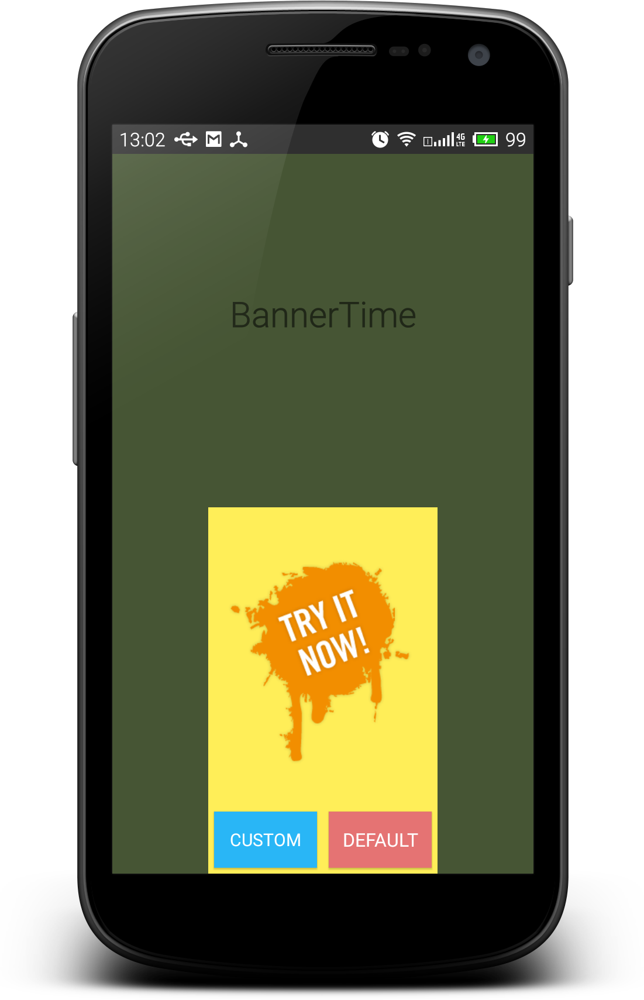
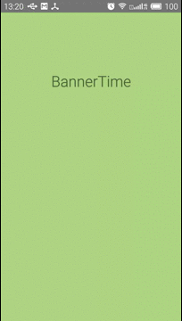
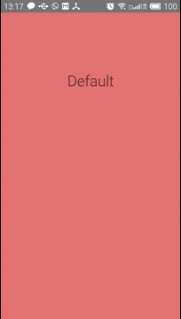
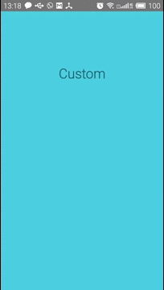

BannerTime
=============

BannerTime create a scheduled popup to show your personal message





Usage
-----

Add library to your build.gradle:

```java

	    compile 'com.jcmore2.bannertime:bannertime:1.1.1'

```

If you don´t want to use Picasso Library
(You may notice that you are not be able to use "imageBanner()" and "imageBannerPlaceholder()" methods):

```java

    compile ('com.jcmore2.bannertime:bannertime:1.1.1') {
        exclude module: 'picasso'
    }
    
```

Init BannerTime in your onResume() Activity:

```java

    @Override
    protected void onResume() {
        super.onResume();
            BannerTime.init(this)
                    .shownTime(4000)
                    .hiddenTime(3000)
                    .imageBanner("http://pre03.deviantart.net/2aa0/th/pre/f/2012/321/d/1/african_landscape_by_dasflon-d5l9t7c.jpg")
                    .withKOButton()
                    .withKOButton()
                    .show();
    }

```




You can also use a callback:

```java

        BannerTime.init(this)
                .shownTime(4000)
                .hiddenTime(3000)
                .imageBanner("http://pre03.deviantart.net/2aa0/th/pre/f/2012/321/d/1/african_landscape_by_dasflon-d5l9t7c.jpg")
                .withKOButton()
                .withKOButton()
                .show(new BannerTime.BannerTimeListener() {
                    @Override
                    public void onShow() {
                        Toast.makeText(mContext, "onShow", Toast.LENGTH_SHORT).show();
                    }

                    @Override
                    public void onDismiss() {
                        Toast.makeText(mContext, "onDismiss", Toast.LENGTH_SHORT).show();

                    }

                    @Override
                    public void onClickOk() {
                        Toast.makeText(mContext, "onClickOk", Toast.LENGTH_SHORT).show();

                    }

                    @Override
                    public void onClickKO() {
                        Toast.makeText(mContext, "onClickKO", Toast.LENGTH_SHORT).show();

                    }

                    @Override
                    public void onClickImage() {
                        Toast.makeText(mContext, "onClickImage", Toast.LENGTH_SHORT).show();

                    }
                });

```


Init BannerTime with your custom view:

```java

       LayoutInflater layoutInflater = (LayoutInflater) mContext.
                getSystemService(Context.LAYOUT_INFLATER_SERVICE);
       View contentView = layoutInflater.inflate(R.layout.custom_banner, null);

       BannerTime.init(this)
                .shownTime(4000)
                .hiddenTime(3000)
                .withView(contentView)
                .setGravity(BannerTime.TOP)
                .show();

```




Pause BannerTime using:

```java

    @Override
    protected void onPause() {
        super.onPause();
        BannerTime.onPause();
    }


```


You can check the sample App!

 Libraries Used
-----------------

[Picasso by Square](http://square.github.io/picasso/)

Credits & Contact
-----------------

FreeView was created by jcmore2@gmail.com


License
-------

BannerTime is available under the Apache License, Version 2.0.
